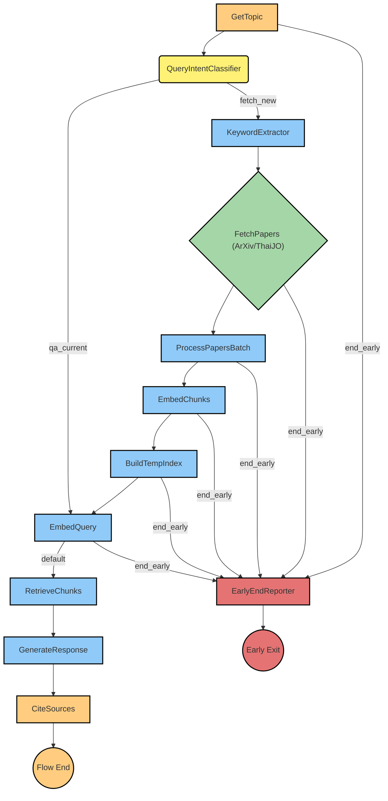

# PocketFlow Research Agent

## Description

A command-line interface (CLI) application that acts as a research agent. It takes user queries, fetches relevant academic papers from specified sources (ArXiv or ThaiJO), processes them, and generates an answer based on the retrieved information. The agent maintains a chat history for contextual understanding in multi-turn conversations.

## Features

* Interactive CLI for research queries.
* Supports fetching papers from ArXiv and ThaiJO.
* Processes fetched papers (PDF parsing, text chunking, embedding generation).
* Retrieval Augmented Generation (RAG) to answer queries based on document content.
* Maintains conversation history for context.
* Configurable initial topic and paper source via command-line arguments.
* Utilizes the PocketFlow framework for orchestrating the agent's workflow.

## Requirements

* Python (refer to `.python-version` or `pyproject.toml` for the specific version)
* `uv` for Python environment and package management.
* Key dependencies (likely defined in `pyproject.toml`):
  * `pocketflow` (or the embedded version in `src/pocketflow_research/pocketflow`)
  * An LLM provider library (e.g., `openai`)
  * A vector store library (e.g., `faiss-cpu` or `faiss-gpu`)
  * PDF processing library (e.g., `pypdf2`, `pymupdf`)
  * API request library (e.g., `requests`, `httpx`)

## Installation

1. **Clone the repository:**
   ```bash
   git clone <your-repository-url>
   cd pocketflow_test
   ```
2. **Set up the Python environment and install dependencies using `uv`:**
   Ensure `uv` is installed. Then, from the project root directory (`pocketflow_test`):
   ```bash
   # Create a virtual environment (recommended)
   uv venv
   # Activate the virtual environment
   # On Windows (PowerShell):
   # .\.venv\Scripts\Activate.ps1
   # On macOS/Linux:
   # source .venv/bin/activate

   # Install dependencies from pyproject.toml
   uv sync
   ```

   *Note: The exact `uv` command for installing dependencies might vary based on your `pyproject.toml` structure. `uv pip install -e .` is common for installing a project as an editable package along with its dependencies.*

## Usage

Run the research agent from the command line using `uv`:

```bash
uv run python src/pocketflow_research/main.py [OPTIONS]
```

**Options:**

* `--source {arxiv,thaijo}`: Specify the paper source. Defaults to `thaijo`.
  * `arxiv`: Use ArXiv as the paper source.
  * `thaijo`: Use ThaiJO as the paper source.
* `--initial_topic TEXT`: Specify an initial research topic to start the conversation. If not provided, the agent will prompt for the first query.

**Examples:**

* Run with ThaiJO (default source) and prompt for the initial topic:
  ```bash
  uv run python src/pocketflow_research/main.py
  ```
* Run with ArXiv as the source and an initial topic:
  ```bash
  uv run python src/pocketflow_research/main.py --source arxiv --initial_topic "Quantum Entanglement"
  ```
* Run with ThaiJO as the source and an initial topic in Thai:
  ```bash
  uv run python src/pocketflow_research/main.py --source thaijo --initial_topic "ผลกระทบของ AI ต่อการศึกษา"
  ```

Once the agent is running, type your research queries in the CLI. To end the session, type `exit` or `quit`.

## Project Structure

```
pocketflow_test/
├── .gitignore
├── .python-version         # Specifies Python version
├── pyproject.toml          # Project metadata and dependencies for uv/pip
├── README.md               # This file
├── src/
│   ├── __init__.py
│   ├── pocketflow_research/  # Main application package
│   │   ├── __init__.py
│   │   ├── main.py           # CLI entry point and main interaction loop
│   │   ├── flow.py           # Defines the PocketFlow agent workflow and node connections
│   │   ├── nodes.py          # Definitions of individual PocketFlow nodes
│   │   ├── models.py         # Data models (e.g., SharedStore, ChatMessage, Paper)
│   │   ├── api.py            # (Potentially for external API interactions if not in nodes)
│   │   ├── core/
│   │   │   └── rag/          # Retrieval Augmented Generation components
│   │   │       ├── chunk_text.py
│   │   │       ├── embedding.py
│   │   │       ├── faiss_utils.py
│   │   │       ├── fetch_arxiv_papers.py
│   │   │       ├── fetch_thaijo_papers.py
│   │   │       └── process_pdf.py
│   │   ├── pocketflow/       # Embedded or local version of the PocketFlow framework
│   │   │   └── __init__.py
│   │   ├── utils/            # Utility functions
│   │   │   ├── __init__.py
│   │   │   ├── call_llm.py
│   │   │   └── proxy_rotatation_request.py # (Likely for robust API calls)
│   │   └── test/             # Unit and integration tests
│   │       ├── test_arxiv_api.py
│   │       └── test_thaijo_api.py
│   └── persistent_faiss_index/ # Directory for storing persistent FAISS index (if used)
├── thaijo_response.json    # Example response from ThaiJO API (for testing/dev)
└── uv.lock                 # Lock file for uv
```

## Flow Diagram

The following diagram illustrates the main workflow of the Research Agent:



**Node Key:**

* `GetTopic`: GetTopicNode
* `QueryIntentClassifier`: QueryIntentClassifierNode
* `KeywordExtractor`: KeywordExtractorNode
* `FetchPapers (ArXiv/ThaiJO)`: FetchArxivNode or FetchThaijoNode (conditional based on `--source`)
* `ProcessPapersBatch`: ProcessPapersBatchNode
* `EmbedChunks`: EmbedChunksNode
* `BuildTempIndex`: BuildTempIndexNode
* `EmbedQuery`: EmbedQueryNode
* `RetrieveChunks`: RetrieveChunksNode
* `GenerateResponse`: GenerateResponseNode
* `CiteSources`: CiteSourcesNode
* `EarlyEndReporter`: EarlyEndReporterNode

This flow shows two main paths after intent classification:

1. **Fetch New**: If the intent is to fetch new documents, the flow proceeds through keyword extraction, paper fetching, processing, embedding, and index building before querying.
2. **QA Current**: If the intent is to query already processed/indexed documents, the flow bypasses new fetching/processing and directly embeds the query to search the existing index (persistent or temporary from a previous "fetch_new" run in the same session).

Both paths converge to retrieve relevant chunks, generate a response, and cite sources. An "end_early" path allows several nodes to terminate the flow prematurely via the `EarlyEndReporter`.

## Development Guidelines

This project follows the "Agentic Coding" principles outlined in `.clinerules/pocketflow.txt`:

1. Start with a small and simple solution.
2. Design at a high level (e.g., in `docs/design.md` if created) before implementation.
3. Frequently ask humans for feedback and clarification.

Python environment and execution should be managed using `uv` as per `.clinerules/uv.txt`.

## Contributing

(Details on how to contribute to the project, coding standards, pull request process, etc. - Placeholder: To be defined)

## License

(Specify the license for your project, e.g., MIT, Apache 2.0. - Placeholder: To be defined)
